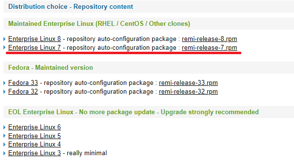
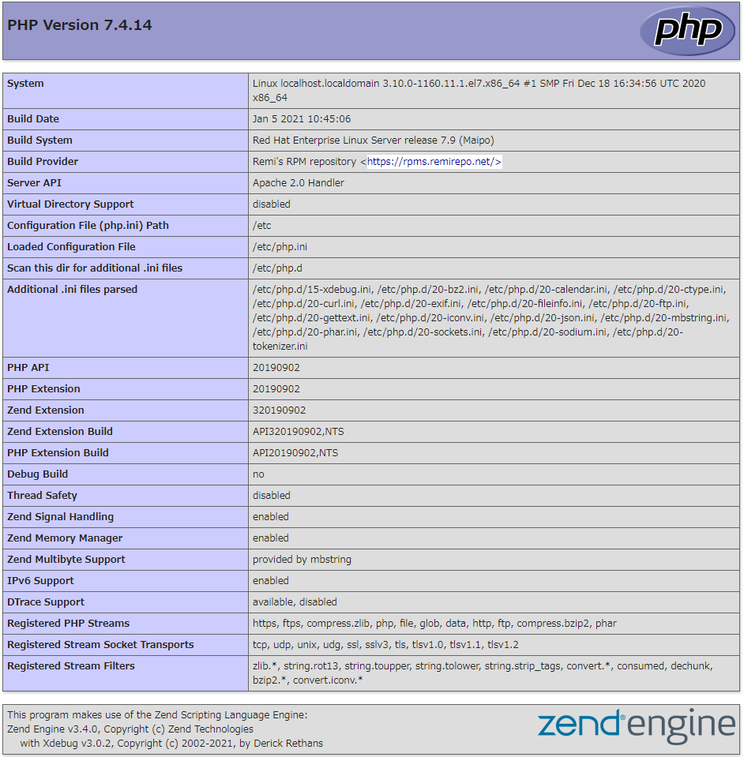
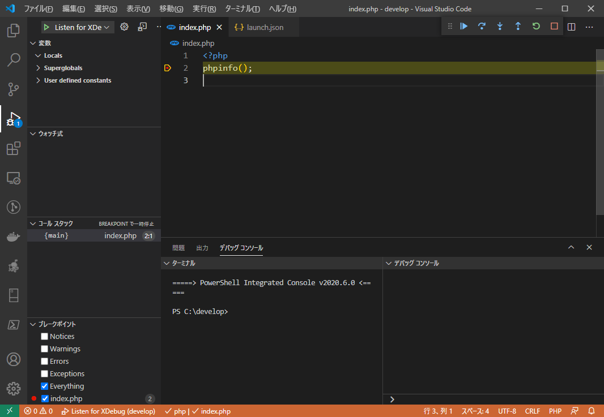

# vs code で PHP のデバッグを有効にする

## 環境

-   クライアント

    -   windows 10

-   サーバ
    -   CentOS 7.8
        -   インストール後に yum update -y でパッケージを最新化
        -   SELinux 無効
        -   firewalld 停止

### ディレクトリ構成

-   サーバ側のディレクトリ構成

```
/home
 └develop
  └─public_html
    └index.php
```

-   ローカルのディレクトリ構成

```
c:\develop
  └─public_html
    └index.php
```

## CentOS 7.8 のインストール後の環境

```
# yum update -y

# cat /etc/redhat-release
CentOS Linux release 7.8.2003 (Core)

# getenforce
Enforcing
# setenforce 0
# getenforce
Permissive
# vi /etc/selinux/config
SELINUX=disabled

# cat /etc/selinux/config
# This file controls the state of SELinux on the system.
# SELINUX= can take one of these three values:
#     enforcing - SELinux security policy is enforced.
#     permissive - SELinux prints warnings instead of enforcing.
#     disabled - No SELinux policy is loaded.
#SELINUX=enforcing
SELINUX=disabled
# SELINUXTYPE= can take one of three values:
#     targeted - Targeted processes are protected,
#     minimum - Modification of targeted policy. Only selected processes are protected.
#     mls - Multi Level Security protection.
SELINUXTYPE=targeted


# systemctl stop firewalld
# systemctl status firewalld
● firewalld.service - firewalld - dynamic firewall daemon
   Loaded: loaded (/usr/lib/systemd/system/firewalld.service; enabled; vendor preset: enabled)
   Active: inactive (dead) since 日 2021-01-10 21:26:52 JST; 1s ago
     Docs: man:firewalld(1)
  Process: 16785 ExecStart=/usr/sbin/firewalld --nofork --nopid $FIREWALLD_ARGS (code=exited, status=0/SUCCESS)
 Main PID: 16785 (code=exited, status=0/SUCCESS)

 1月 10 21:23:45 localhost.localdomain systemd[1]: Starting firewalld - dynamic firewall daemon...
 1月 10 21:23:46 localhost.localdomain systemd[1]: Started firewalld - dynamic firewall daemon.
 1月 10 21:23:46 localhost.localdomain firewalld[16785]: WARNING: AllowZoneDrifting is enabled. This is considered an insecure configuration option. It will be removed in a future release. Ple...ling it now.
 1月 10 21:26:52 localhost.localdomain systemd[1]: Stopping firewalld - dynamic firewall daemon...
 1月 10 21:26:52 localhost.localdomain systemd[1]: Stopped firewalld - dynamic firewall daemon.
Hint: Some lines were ellipsized, use -l to show in full.

# ls /etc/yum.repos.d
CentOS-Base.repo  CentOS-CR.repo  CentOS-Debuginfo.repo  CentOS-Media.repo  CentOS-Sources.repo  CentOS-Vault.repo  CentOS-fasttrack.repo  CentOS-x86_64-kernel.repo

# yum repolist
読み込んだプラグイン:fastestmirror
Loading mirror speeds from cached hostfile
 * base: ftp-srv2.kddilabs.jp
 * extras: ftp-srv2.kddilabs.jp
 * updates: ftp-srv2.kddilabs.jp
リポジトリー ID        リポジトリー名           状態
base/7/x86_64         CentOS-7 - Base         10,072
extras/7/x86_64       CentOS-7 - Extras          448
updates/7/x86_64      CentOS-7 - Updates       1,155
repolist: 11,675
```

## Apache のインストール

```
# yum install httpd -y
```

## PHP7.4 のインストール

-   標準のリポジトリには新しい PHP が入っていないので[remi](http://rpms.remirepo.net/)からインストールする<br>
-   remi のリポジトリを追加
-   remi-php74.repo を使って PHP7.4 をインストール
-   PHP をデバッグする為に xdebug3 をインストール

```
# yum install http://rpms.remirepo.net/enterprise/remi-release-7.rpm -y

# ls /etc/yum.repos.d
CentOS-Base.repo  CentOS-Debuginfo.repo  CentOS-Sources.repo  CentOS-fasttrack.repo      epel-testing.repo  remi-glpi91.repo  remi-glpi93.repo  remi-modular.repo  remi-php70.repo  remi-php72.repo  remi-php74.repo  remi-safe.repo
CentOS-CR.repo    CentOS-Media.repo      CentOS-Vault.repo    CentOS-x86_64-kernel.repo  epel.repo          remi-glpi92.repo  remi-glpi94.repo  remi-php54.repo    remi-php71.repo  remi-php73.repo  remi-php80.repo  remi.repo

# yum repolist
読み込んだプラグイン:fastestmirror
Loading mirror speeds from cached hostfile
 * base: ftp-srv2.kddilabs.jp
 * epel: nrt.edge.kernel.org
 * extras: ftp-srv2.kddilabs.jp
 * remi-safe: ftp.riken.jp
 * updates: ftp-srv2.kddilabs.jp
リポジトリー ID        リポジトリー名                                                 状態
base/7/x86_64         CentOS-7 - Base                                               10,072
epel/x86_64           Extra Packages for Enterprise Linux 7 -                       13,491
extras/7/x86_64       CentOS-7 -                                                       448
remi-safe             Safe Remi's RPM repository for Enterprise Linux 7 - x86_64     4,056
updates/7/x86_64      CentOS-7 - Updates                                             1,155
repolist: 29,222

# yum --enablerepo=remi-php74 install php php-mbstring php-pecl-xdebug3 -y

# yum list installed | grep php
oniguruma5php.x86_64                 6.9.6-1.el7.remi               @remi-safe
php.x86_64                           7.4.14-1.el7.remi              @remi-php74
php-cli.x86_64                       7.4.14-1.el7.remi              @remi-php74
php-common.x86_64                    7.4.14-1.el7.remi              @remi-php74
php-json.x86_64                      7.4.14-1.el7.remi              @remi-php74
php-mbstring.x86_64                  7.4.14-1.el7.remi              @remi-php74
php-pecl-xdebug3.x86_64              3.0.2-1.el7.remi.7.4           @remi-php74
php-sodium.x86_64                    7.4.14-1.el7.remi              @remi-php74
```

## apache の起動とテスト用の index.php の作成

-   systemctl status で enable, running になっている事を確認
    -   Loaded: loaded (/usr/lib/systemd/system/httpd.service; <span style="color: red"><strong>enabled</strong></span>; vendor preset: disabled)
    -   Active: active (<span style="color: red"><strong>running</strong></span>) since 日 2021-01-10 21:10:25 JST; 25s ago

```
# systemctl start httpd

# systemctl enable httpd
Created symlink from /etc/systemd/system/multi-user.target.wants/httpd.service to /usr/lib/systemd/system/httpd.service.

# systemctl status httpd
systemctl status httpd
● httpd.service - The Apache HTTP Server
   Loaded: loaded (/usr/lib/systemd/system/httpd.service; enabled; vendor preset: disabled)
   Active: active (running) since 日 2021-01-10 21:10:25 JST; 25s ago
     Docs: man:httpd(8)
           man:apachectl(8)
 Main PID: 16036 (httpd)
   Status: "Total requests: 0; Current requests/sec: 0; Current traffic:   0 B/sec"
   CGroup: /system.slice/httpd.service
           tq16036 /usr/sbin/httpd -DFOREGROUND
           tq16037 /usr/sbin/httpd -DFOREGROUND
           tq16038 /usr/sbin/httpd -DFOREGROUND
           tq16039 /usr/sbin/httpd -DFOREGROUND
           tq16040 /usr/sbin/httpd -DFOREGROUND
           mq16041 /usr/sbin/httpd -DFOREGROUND

 1月 10 21:10:25 localhost.localdomain systemd[1]: Starting The Apache HTTP Server...
 1月 10 21:10:25 localhost.localdomain httpd[16036]: AH00558: httpd: Could not reliably determine the server's fully qualified domain name, using localhost.localdomain. Set the 'ServerName' d... this message
 1月 10 21:10:25 localhost.localdomain systemd[1]: Started The Apache HTTP Server.
Hint: Some lines were ellipsized, use -l to show in full.

# cat <<EOF > /var/www/html/index.php
<?php
phpinfo();
EOF
```

## php の動作確認

-   ブラウザから(http://192.168.0.251/index.php)へアクセスして以下の画面が表示されることを確認。
    

## apache の設定を変更して userdir を有効化する

```
# cp -p /etc/httpd/conf.d/userdir.conf /etc/httpd/conf.d/userdir.conf.`date "+%Y%m%d"`

# vi /etc/httpd/conf.d/userdir.conf
    #UserDir disabled
    UserDir public_html

# diff /etc/httpd/conf.d/userdir.conf /etc/httpd/conf.d/userdir.conf.20210110
17c17
<     #UserDir disabled
---
>     UserDir disabled
24c24
<     UserDir public_html
---
>     #UserDir public_html

# cat /etc/httpd/conf.d/userdir.conf
#
# UserDir: The name of the directory that is appended onto a user's home
# directory if a ~user request is received.
#
# The path to the end user account 'public_html' directory must be
# accessible to the webserver userid.  This usually means that ~userid
# must have permissions of 711, ~userid/public_html must have permissions
# of 755, and documents contained therein must be world-readable.
# Otherwise, the client will only receive a "403 Forbidden" message.
#
<IfModule mod_userdir.c>
    #
    # UserDir is disabled by default since it can confirm the presence
    # of a username on the system (depending on home directory
    # permissions).
    #
    #UserDir disabled

    #
    # To enable requests to /~user/ to serve the user's public_html
    # directory, remove the "UserDir disabled" line above, and uncomment
    # the following line instead:
    #
    UserDir public_html
</IfModule>

#
# Control access to UserDir directories.  The following is an example
# for a site where these directories are restricted to read-only.
#
<Directory "/home/*/public_html">
    AllowOverride FileInfo AuthConfig Limit Indexes
    Options MultiViews Indexes SymLinksIfOwnerMatch IncludesNoExec
    Require method GET POST OPTIONS
</Directory>

```

## userdir のテスト

-   root

```
# useradd develop
# chown :apache develop
# chmod 710 develop
```

-   develop ユーザー
    -   先ほどと同じ様に phpinfo の画面が出たら OK

```
$ mkdir public_html
$ cat <<EOF > ~/public_html/index.php
<?php
phpinfo();
EOF
```

## xdebug の設定を/etc/php.ini に追記する

-   /etc/php.ini の最終行に追記する

-   設定の参考

    -   PHP8.0 検証ついでに xdebug の警告解消<br>https://qiita.com/pickles/items/d9a6ae17ba1b4ed0d53c
    -   Xdebug 3 アップグレードガイド 私訳<br>https://php-tips.com/2020/12/28/xdebug3-upgrade-guid/

-   xdebug.discover=1 に設定した場合 php にアクセスしたクライアントに対して php 側からデバッグ用に接続してくれる。
    -   discover=1 の場合は client_host の値は無効となるのでコメントアウトすること。
-   デバッグ先のクライアントを固定したい場合は discover=0 にして client_host に vs code を実行しているクライアントの IP アドレスを設定する。
-   両方設定した場合は discover の設定が優先される。

```
# cp -i /etc/php.ini /etc/php.ini.`date "+%Y%m%d"`
# vi /etc/php.ini

[xdebug]
xdebug.mode=debug
# xdebug.client_host=192.168.0.50
xdebug.client_port=9000
xdebug.start_with_request=yes
xdebug.remote_cookie_expire_time=3600
xdebug.log=/tmp/xdebug.log
xdebug.discover_client_host=1

# diff /etc/php.ini /etc/php.ini.20210110
1679,1687d1678
<
< [xdebug]
< xdebug.mode=debug
< xdebug.client_host=192.168.0.50
< xdebug.client_port=9000
< xdebug.start_with_request=yes
< xdebug.remote_cookie_expire_time=3600
< xdebug.log=/tmp/xdebug.log
< xdebug.discover_client_host=1

# systemctl restart httpd
```

## vs code の設定

### 拡張機能のインストール

-   ファイル → ユーザー設定 → 拡張機能を選択 -> PHP で検索
-   PHP Debug をインストール

```
名前: PHP Debug
ID: felixfbecker.php-debug
説明: Debug support for PHP with XDebug
バージョン: 1.14.5
パブリッシャー: Felix Becker
VS Marketplace リンク: https://marketplace.visualstudio.com/items?itemName=felixfbecker.php-debug
```

### lunch.json の作成

-   実行メニュー → 構成を開く → PHP を選択

#### lunch.json(変更前)

-   テンプレートのファイルが./vscode/lunch.json が作られる

```json
{
    // IntelliSense を使用して利用可能な属性を学べます。
    // 既存の属性の説明をホバーして表示します。
    // 詳細情報は次を確認してください: https://go.microsoft.com/fwlink/?linkid=830387
    "version": "0.2.0",
    "configurations": [
        {
            "name": "Listen for XDebug",
            "type": "php",
            "request": "launch",
            "port": 9000
        },
        {
            "name": "Launch currently open script",
            "type": "php",
            "request": "launch",
            "program": "${file}",
            "cwd": "${fileDirname}",
            "port": 9000
        }
    ]
}
```

#### lunch.json(変更後)

-   php.ini に指定したポート番号
-   pathMappings にデバッグをしたいファイルのあるディレクトリと vs code のディレクトリの対応を記載する

```json
{
    // IntelliSense を使用して利用可能な属性を学べます。
    // 既存の属性の説明をホバーして表示します。
    // 詳細情報は次を確認してください: https://go.microsoft.com/fwlink/?linkid=830387
    "version": "0.2.0",
    "configurations": [
        {
            "name": "Listen for XDebug",
            "type": "php",
            "request": "launch",
            "port": 9000,
            "pathMappings": { "/home/develop/public_html": "${workspaceFolder}" }
        },
        {
            "name": "Launch currently open script",
            "type": "php",
            "request": "launch",
            "program": "${file}",
            "cwd": "${fileDirname}",
            "port": 9000
        }
    ]
}
```

#### vs code でデバッグ

-   vs code でデバッグしたいファイルを選択
-   ブレイクポイントを追加して F5 でデバッグを実行


